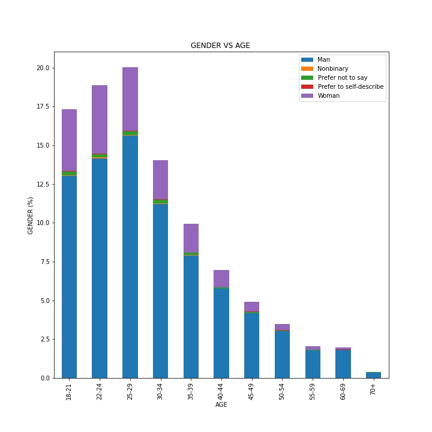
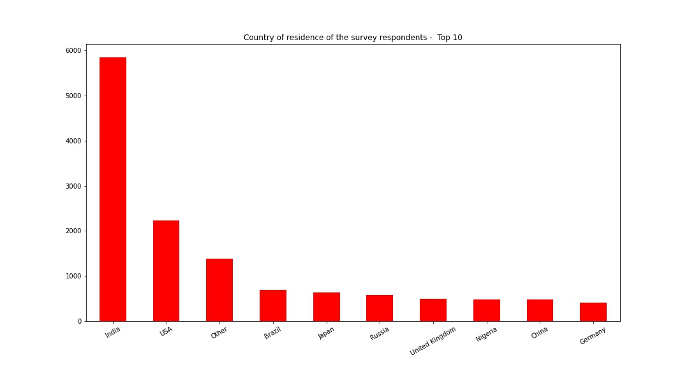
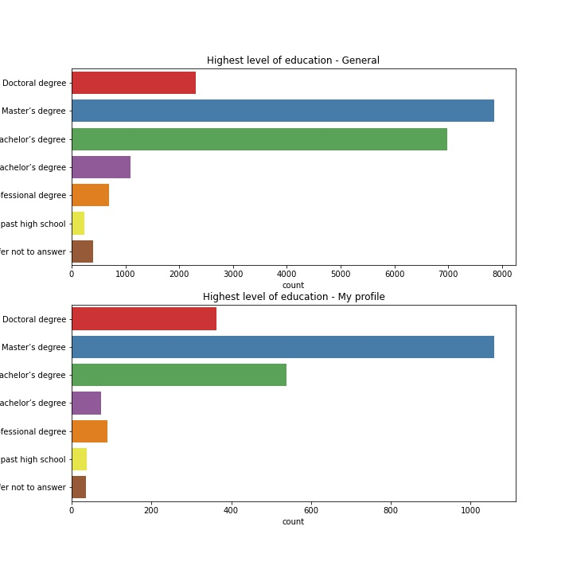
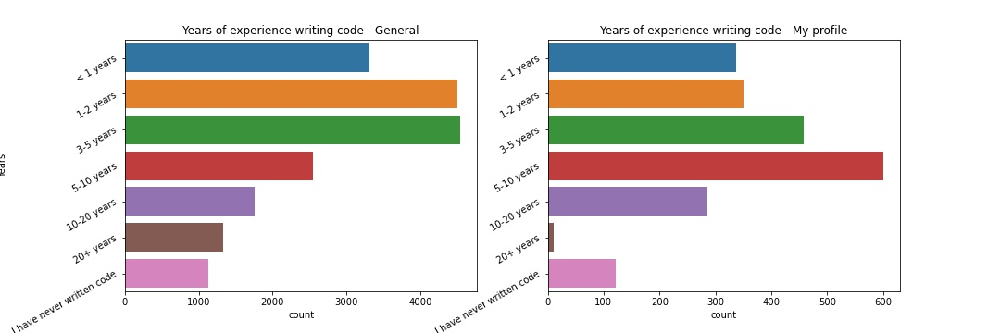
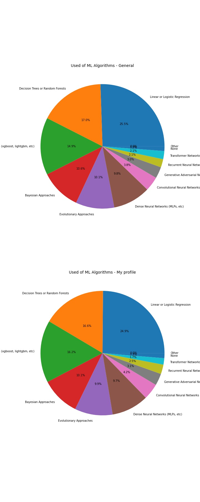
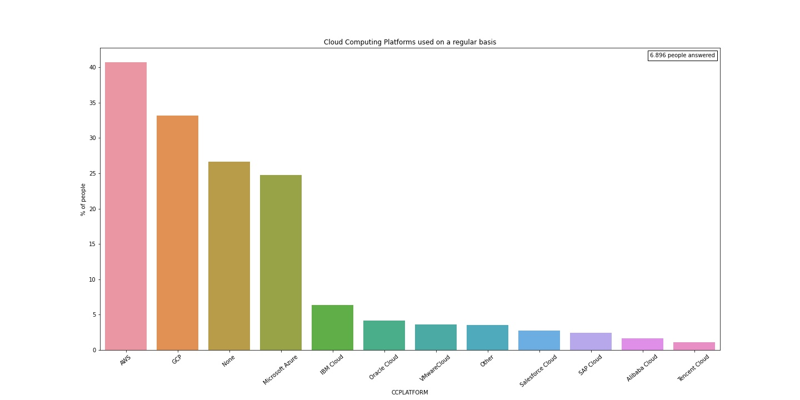
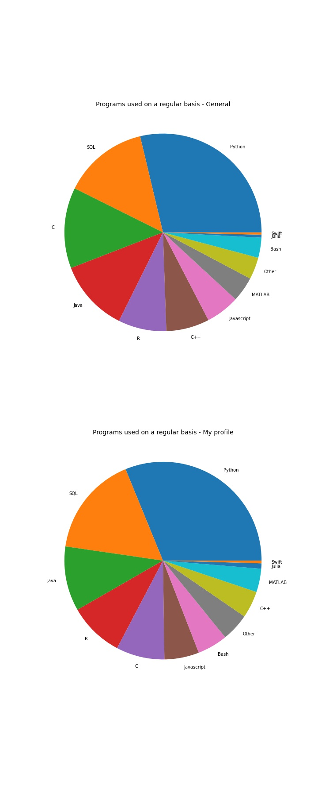

# KAGGLE SURVEY 2020 ANALYSIS
This repo contains an analysis of the 2020 Kaggle Machine Learning &amp; Data Science Survey. The data used is located in this link: https://www.kaggle.com/c/kaggle-survey-2020/data 


### DATA ENGINEERING
The [Data Cleaning notebook](https://github.com/rfisla/KAGGLE_SURVEY_2020_ANALYSIS/blob/main/DATA_CLEANING.ipynb) shows the changes and transformations made as the previous step of analizing the Kaggle Survey. The main points of these notebook are:

- The first step was joining the 2 first rows into a unique header (joining the number of the question with the question)

- The main goal was to join the columns that are part of the same question, in order to have all the answers in the same column and make the following analysis easier.
This was the function that solved this problem:

```python
def grouping(a,b):
    name = input("Enter the name of the column: ")
    survey[name] = survey.iloc[:,a:b].apply(' '.join, axis=1)
    survey.drop(survey.iloc[:,a:b], 1 , inplace= True)
```
Where 'a' is the column where the question starts and 'b' the column where the question ends

- The final step was enumerating the columns by adding another index, in order to to identify and work better with them during the analysis.

### DATA ANALYSIS THROUGH GRAHPS

I graphically represented those questions that I was more interested on. In some of the questions I wanted to know if there was some differences between the answers of the general survey and the answers of people of my range of age, so in those questions I represent two graphs, one for each profile, to compare the results.

**The general survey has been done by 20.036 persons, and the number of people who match with my profile is 2.246**

These are the main graphs obtained from the notebook:


#### Gender VS Age


#### Country of residence (comparison)


#### Highest level of education (comparison)


#### Years of experience writing code or programming (comparison)


#### Used of Machine Learning Algorithms (comparison)


#### Cloud computing platforms used on a regular basis (comparison)


#### Programs used on a regular basis (comparison)


#### How many individuals are responsible for data science workloads at the place of business


