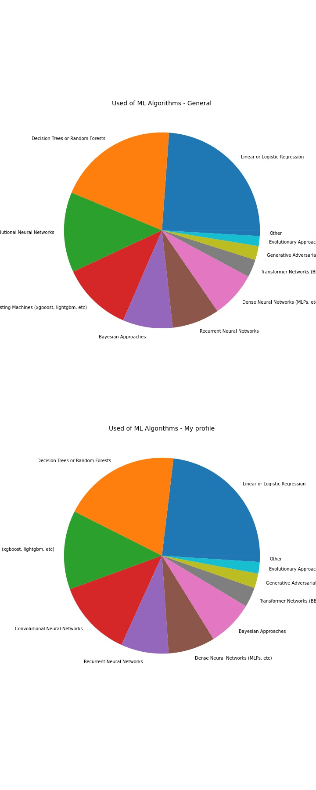
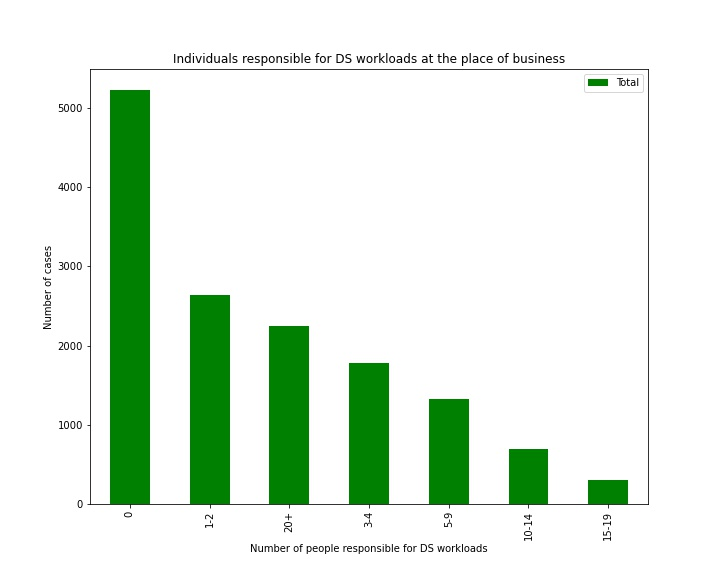

# KAGGLE SURVEY 2020 ANALYSIS
This repo contains an analysis of the 2020 Kaggle Machine Learning &amp; Data Science Survey. The data used is located in this link: https://www.kaggle.com/c/kaggle-survey-2020/data 


### DATA ENGINEERING
The [Data Cleaning notebook](https://github.com/rfisla/KAGGLE_SURVEY_2020_ANALYSIS/blob/main/DATA_CLEANING.ipynb) shows the changes and transformations made as the previous step of analizing the Kaggle Survey. The main points of these notebook are:

- The first step was joining the 2 first rows into a unique header (joining the number of the question with the question)

- The main goal was to join the columns that are part of the same question, in order to have all the answers in the same column and make the following analysis easier.
This was the function that solved this problem:

```python
def grouping ():
    # 1. Filtering the columns I´m going to group by selecting the question
    #2. Joining the columns of the same question into one new column
    #3. Dropping the columns used
    question = input('Enter the number of the question')
    name = input("Enter the name of the column: ")
    survey[name] = survey.filter(regex=question, axis=1).apply(' '.join, axis=1)
    survey.drop(survey.filter(regex=question, axis=1), 1 , inplace= True)
    return f'{question} grouped'
```
- The final step was enumerating the columns by adding another index, in order to to identify and work better with them during the analysis.


### DATA ANALYSIS THROUGH GRAHPS [Link](https://github.com/rfisla/KAGGLE_SURVEY_2020_ANALYSIS/blob/main/KAGGLE_SURVEY_ANALYSIS.ipynb)

I needed a way to count and rank the grouped columns, which have several items in the same row. This is the function created for this goal:

```python
def ranking_by_column(data, number_of_column, list_of_options):
    list = []
    for i in data.iloc[:,number_of_column]:
        list.append(i)
    string = ' '. join(list)
    count = []
    for i in list_of_options:
        count.append(string.count(i))
    ranking = pd.DataFrame(data= count, index= list_of_options, columns=['Total']).sort_values(by='Total',ascending=False)
    #ranking['%'] = ranking['Total'].apply(lambda x: x/20036*100)
    return ranking
  ```

I graphically represented those questions that I was more interested on. In some of the questions I wanted to know if there was some differences between the answers of the general survey and the answers of people of my range of age, so in those questions I represent two graphs, one for each profile, to compare the results.

- **The general survey has been done by 20.036 persons, and the number of people who matched with my profile is 2.246**
- **There are many questions not answered by all the survey respondents (blank spaces in the dataframe). I point out the number of people who answered the questions in those where there are a significant number of missed answers**
- **In those graphs with percentages, it´s been applied over the numer of people who answered that specific question, not over all the survey respondents**

### **These are the main graphs obtained from the notebook:**


#### Gender VS Age


#### Country of residence 


#### Highest level of education (comparison)


#### Years of experience writing code or programming (comparison)


#### Comparing the job titles between the general profile and my profile


#### Comparing the job titles with the size of the company they are working in


#### Comparing the job title with the age


#### Used of Machine Learning Algorithms (comparison)


#### Cloud computing platforms used on a regular basis 


#### Programs used on a regular basis (comparison)


#### Data visualization libraries or tools used on a regular basis


#### Big data products (relational databases, data warehouses, data lakes, or similar) used on a regular basis


#### Integrated development environments (IDE's) used  on a regular basis


#### Machine learning frameworks used on a regular basis


#### Does their current employer incorporate machine learning methods into their business?


#### Activities that make up an important part of their role at work


#### Business intelligence tools used on a regular basis


#### Type of computing platform used most often for their data science projects


#### Numer of individuals that are responsible for data science workloads at the place of business



